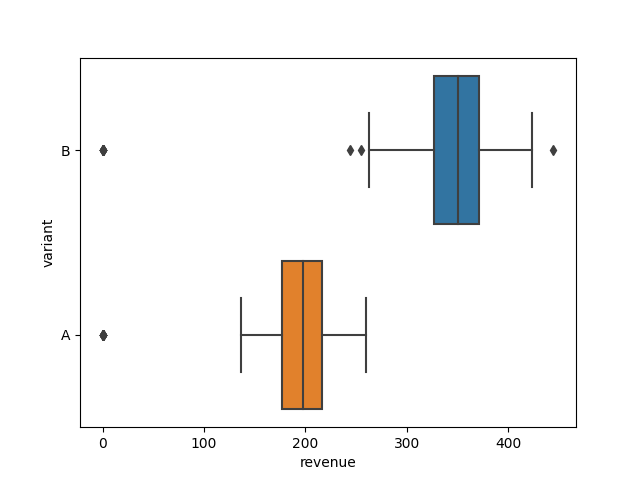
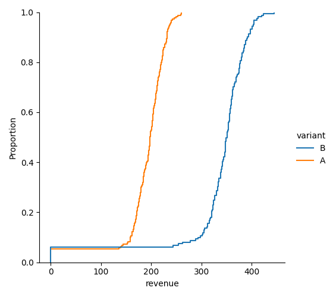
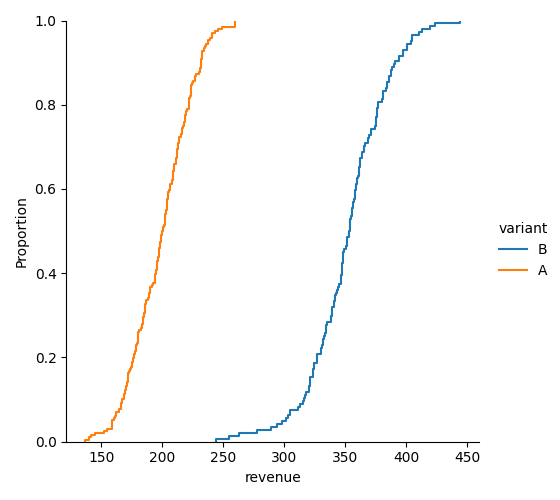
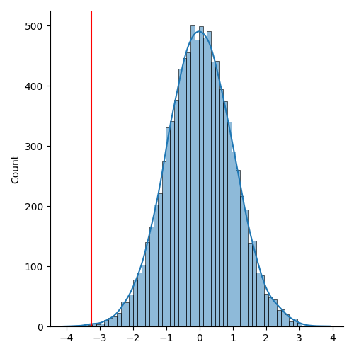
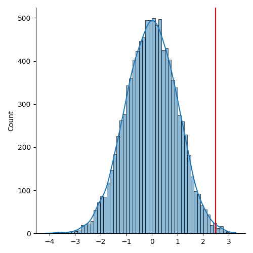
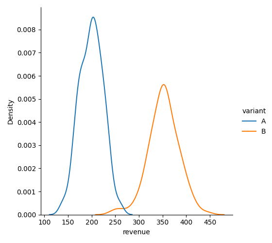
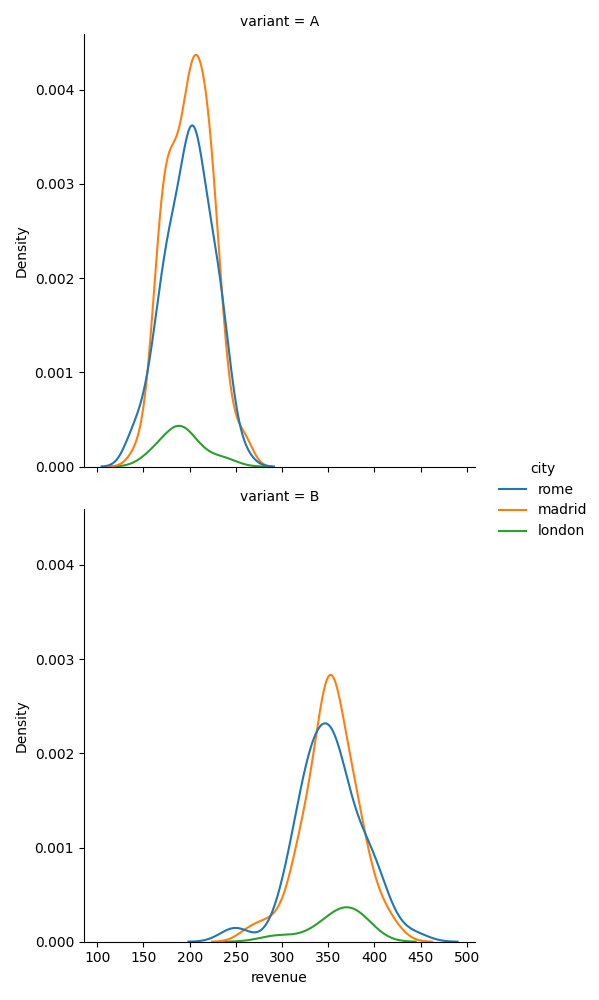

# Technical exercise - Summary report

## Summary

We are supposed to analyze the results obtained from an A/B test done on fees charged to customers when they book a home. During the month of August 2021, customers where divided into two groups with a rough 50%/50% split. The control group (**A**) were presented with the same fees as before, while the treatment/experiment group (**B**) saw an increased value.

We would like to know if the experimental hypothesis holds, that is:
- Conversion rates may decrease due to the higher prices
- Extra revenue per booking may compensate this by robustly increasing the revenue per visiting user

As we will explain in the next sections, we conclude that the experimental hypothesis does indeed hold. The proposed 76.79% +/- 4.06% increase in the booking fee may reduce the conversion rate by 25.40%. However, it is expected that the mean revenue per visiting customer may increase by 28.89%. We then recommend the new fee.

## Basic data exploration

We first take a look at some basic metrics obtained from the raw logs:

```
--- Raw logs metrics ---

Number of users:
1676

Number of users assigned to each variant:
A      839
B      837

Number of users visiting each city:
madrid   876
  rome   712
london    88
```

Before assessing if the dataset needs cleaning, we see that the splitting does indeed follow a 50%/50% split. It is also limited to 3 cities: Madrid, Rome, and London, with most of the data coming from the first two.

If we look at the revenue distribution we see that the price increase is quite noticeable:





Just from the plot we see that the increase is roughly 75% (more on this in the last section). We also see some non-zero revenue values, which of course will need to be cleaned.

We filter the logs so that the following conditions are true:
- A user may be assigned to only one variant. There should be no events for the same user in different variants.
- A booking request always has a revenue greater than zero.
- A user can perform only one booking request.

The metrics for the cleaned dataset are the following:

```
Number of records:
15486

Number of users:
1618

Number of users assigned to each variant:
B      812
A      806

Number of users visiting each city:
madrid   848
  rome   686
london    84
```

We lost 6.6% of the records and 3.5% of the users. However, the population is still big enough to be representative and the experimental split is still roughly even. The resulting revenue distribution is also quite close to the original one:



The results of the experiment can be briefly summarized in a table:

```
---- Experiment summary ---
   tot_users  tot_bookings  tot_revenue    cvr     rpu
A        806           203    39050.62   25.2%   48.45
B        812           153    50706.19   18.8%   62.45
```

where
- `tot_users`: total number of users for each segment
- `tot_bookings`: total number of booking requests
- `tot_revenue`: total revenue obtained for each segment
- `cvr`: conversion rate per user
- `rpu`: revenue per user


## Conversion rate analysis

We can test if the decrease in the conversion rate is statistically significant by performing a simple Z-test:

```
--- Test for: Conversion ---
--- Method: Z-test ---

Expected downlift: 25.40%

P-value: 0.06%

Significant at 95%!
Observed power: 99.97%

Significant at 99%!
Observed power: 99.73%

```

Given that the sample is sufficiently big and the downlift is so pronounced, it is not really a surprise that the change in the conversion rate is significant at a 99% confidence level. The price increase was high enough to discourage a significant portion of the user to finally request a booking.

In order to set the stage for the revenue per user analysis, let us repeat the analysis using bootstrap resampling (more on this in the next section):

```

--- Test for: Conversion ---
--- Method: Bootstrap resampling ---

Expected downlift: 25.40%

Estimate for A (95% confidence): 0.24 +/- 0.03
Estimate for B (95% confidence): 0.18 +/- 0.03

P-value: 0.11%

Significant at 95%!
Significant at 99%!
```



We find once again that the downlift is significant.


## Revenue per user analysis

In order to properly analyze if the uplift in the revenue per user is significant, we need to make sure that we sample correctly from the two groups, taking into account the visiting users who did not request a booking. Also, we need to take into account that the revenue distribution is not gaussian, so we preferably should try to use a non-parametric method.

We will bootstrap resampling, that is, repeatedly sampling from the observed set of records in such a way that we can estimate the desired statistic (that is, the difference between the expected revenue per user):

```
--- Test for: Revenue ---
--- Method: Bootstrap resampling ---

Expected uplift: 28.89%

Estimate for A (95% confidence): 48.53€ +/- 5.97€
Estimate for B (95% confidence): 62.57€ +/- 9.24€

P-value: 0.52%

Significant at 95%!
Significant at 99%!
```



The increase in revenue per visiting user is statistically significant. This implies that the decrease in the conversion rate did not affect the global revenue and we can expect that the new fee will be profitable.

## Percentage increase analysis

The revenue values of the variants form concentrated distributions:



We can gain further insight into how the work by looking at the distribution for each city:



Even though we could try to analyze these distributions by using a Gaussian approximation, we see that that in reality they are multimodal, that is, they seem like a mixture of different, simpler distributions. This may be due to the fact that each city may have different types of homes (different sizes, different neighborhoods, different touristic appeal). It is then probably better to use bootstrapping once again in order to estimate the percentage change:

```
---- Percentage increase estimate ---
Estimate for A (95% confidence): 199.20€ +/- 3.46€
Estimate for B (95% confidence): 352.18€ +/- 5.30€
Estimate for rate (95% confidence): 76.79% +/- 4.06%
```

We estimate the confidence interval for the rate by using simple [error propagation](https://en.wikipedia.org/wiki/Propagation_of_uncertainty#Simplification). We can repeat this exercise for each of the cities:

```
--- Estimates for city: Madrid
Estimate for A (95% confidence): 199.95€ +/- 4.61€
Estimate for B (95% confidence): 351.96€ +/- 7.19€
Estimate for rate (95% confidence): 76.03% +/- 5.42%

--- Estimates for city: Rome
Estimate for A (95% confidence): 199.04€ +/- 5.43€
Estimate for B (95% confidence): 351.13€ +/- 8.28€
Estimate for rate (95% confidence): 76.41% +/- 6.36%

--- Estimates for city: London
Estimate for A (95% confidence): 194.00€ +/- 14.44€
Estimate for B (95% confidence): 353.22€ +/- 19.43€
Estimate for rate (95% confidence): 82.07% +/- 16.85%
```

These values are in accordance to the rough estimate we did using the boxplot of the revenue. We also notice that the estimates obtained from Madrid and Rome are quite close to the global estimates. London, having fewer observations, has larger error and, consequently, a far less reliable estimate.

Assuming that the there are no red flags concerning the experimental design (for instance, uneven geographical distributions or biased variant allocation), we expect that the rate estimate is reliable. However, it is advisable to further analyze if the features of the homes that were successfully booked are not affecting the result (for instance, more expensive homes being less likely to be booked after the fee increase, leading to a sort of survival bias towards cheaper homes, effectively increasing the computed rate). If no further information is available, we advise to err on the side of caution and lean towards the lower values of the confidence interval.
